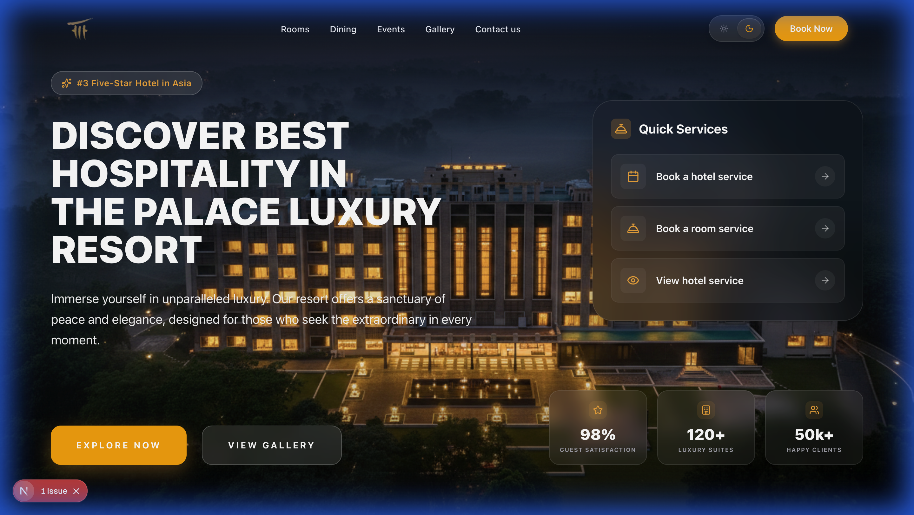
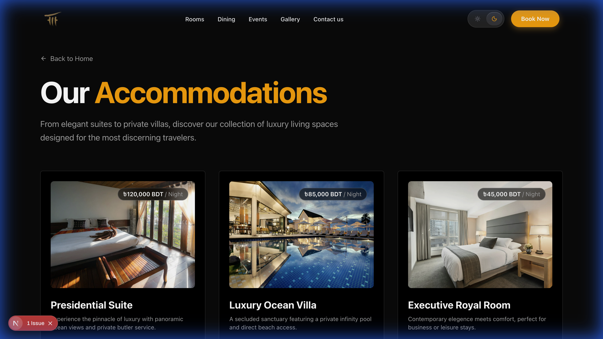
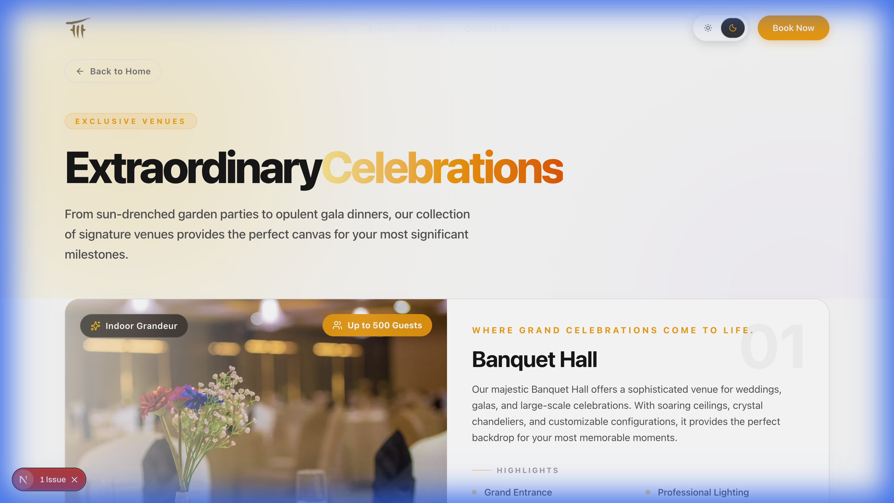

# 🏰 The Palace Resort

Welcome to the digital home of **The Palace Resort**, a premium luxury destination designed to provide an unparalleled experience of elegance and comfort. This application is a modern, high-performance web platform built to showcase the resort's world-class amenities, exquisite dining, and grand event spaces.

---

## ✨ Features

-   **🌊 Immersive Visuals**: Stunning hero section and high-quality imagery throughout the site.
-   **🎨 Dynamic Aesthetics**: An animated gradient background and liquid glass effects provide a premium, modern feel.
-   **🌙 Smart Themes**: Full support for Light and Dark modes with a carefully curated color palette.
-   **🍽️ Gourmet Dining**: Explore our signature restaurants—Olive, Rebulation, Arabian Lounge, Lostalgia, and Saigon.
-   **🛌 Luxury Accommodations**: Browse our diverse range of rooms and suites with interactive spotlight cards.
-   **🎉 Grand Events**: Plan your perfect event in our banquet halls, meeting rooms, or lush outdoor lawns.
-   **🖼️ Visual Gallery**: Explore the resort's beauty through an interactive bento-grid gallery with GSAP scroll velocity effects.
-   **📱 Fully Responsive**: A seamless experience across mobile, tablet, and desktop devices.
-   **⚡ High Performance**: Built with the latest web technologies for lightning-fast load times.

---

## 📸 Screenshots

### 🏠 Home Page

*Our immersive landing page featuring the hero section and crystal-clear calls to action.*

### 🛌 Rooms & Suites

*Interactive spotlight cards showcasing our luxurious accommodation options.*

### 🍽️ Culinary Excellence

*A dedicated space to explore the diverse and exquisite dining options available at the resort.*

### 🎊 Events & Celebrations

*Detailed views of our versatile event venues, from banquet halls to fountain-view lawns.*

### 🖼️ Resort Gallery

*An interactive bento-grid gallery showcasing the resort's luxury through smooth GSAP animations.*

---

## 🛠️ Tech Stack

-   **Framework**: [Next.js](https://nextjs.org/) (App Router)
-   **Styling**: [Tailwind CSS 4](https://tailwindcss.com/)
-   **Animations**: [Framer Motion](https://www.framer.com/motion/) & [GSAP](https://greensock.com/gsap/)
-   **3D Elements**: [Three.js](https://threejs.org/) with [React Three Fiber](https://docs.pmnd.rs/react-three-fiber)
-   **Icons**: [Lucide React](https://lucide.dev/)
-   **Theme Management**: [Next Themes](https://github.com/pacocoursey/next-themes)
-   **Language**: [TypeScript](https://www.typescriptlang.org/)

---

## 🚀 Getting Started

### Prerequisites

-   Node.js 18.x or later
-   npm or yarn

### Installation

1.  **Clone the repository**:
    ```bash
    git clone https://github.com/your-username/the-palace-resort.git
    cd the-palace-resort
    ```

2.  **Install dependencies**:
    ```bash
    npm install
    ```

3.  **Run the development server**:
    ```bash
    npm run dev
    ```

4.  **Open in your browser**:
    Navigate to [http://localhost:3000](http://localhost:3000) to see the application in action.

---

## 🏗️ Project Structure

-   `app/`: Contains the routes and layout of the application (e.g., `/rooms`, `/dining`, `/events`, `/gallery`).
-   `components/`: Reusable UI components including the `GalleryGrid`, `Hero`, `Navbar`, and more.
-   `public/`: Static assets including images, fonts, and screenshots.
-   `lib/`: Helper functions and constants.
-   `hooks/`: Custom React hooks.

---

## 📜 License

This project is licensed under the MIT License.

---

Developed with ❤️ for **The Palace Resort**.
